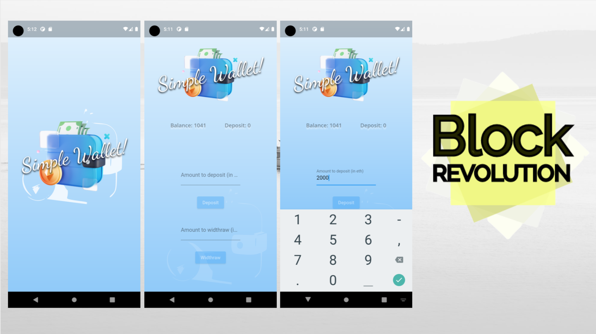
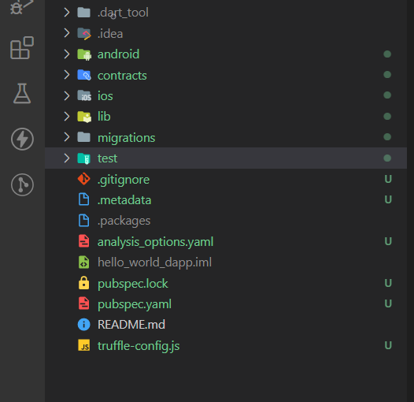
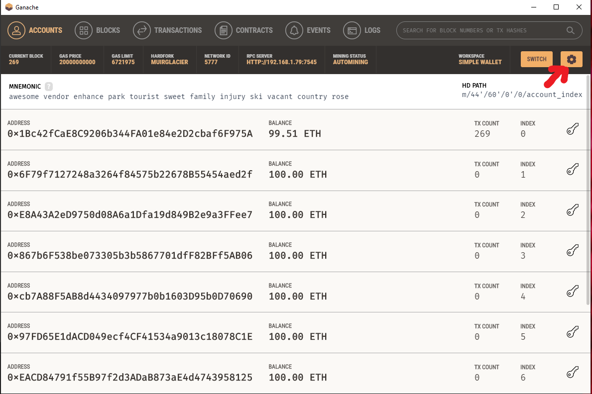
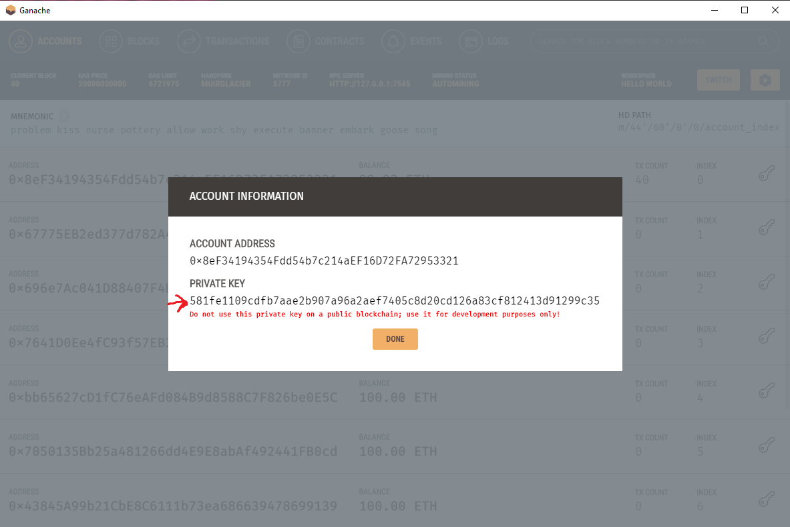
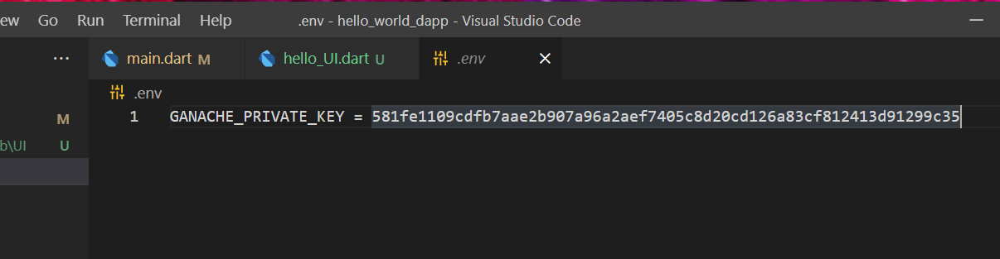
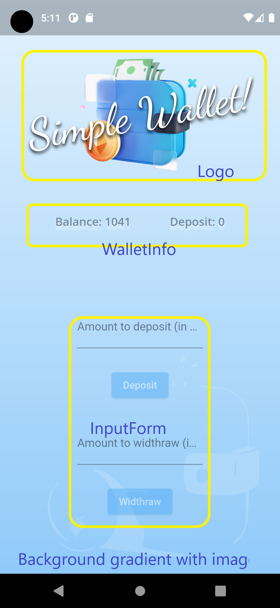

# Simple Wallet

A Flutter project to interact with the blockchain that uses truffle and solidity to write Ethereum smart contracts.

## Tutorial

**1. Setting up the development environment**
> `npm install -g truffle`

**3. Create a flutter project**
> `flutter create simple_wallet`

**2. Creating a Truffle Project**

   Initialize Truffle inside the flutter project directory.
 > `truffle init`


**3. Directory Structure**
   

* **contracts/**: Contains the solidity contract fie.
* **migrations/**: Contains the migration script files.
* **test/**: Contains test script files.
*  **truffle-config.js**: Contains truffle deployment configurations information.
      
**4. Writing the Smart Contract**

``` javascript
// SPDX-License-Identifier: GPL-3.0
pragma solidity >=0.6.2 <0.9.0;

contract Investment {
    uint256 balanceAmount;
    uint256 depositValue;
    uint256 thresholdAmount;
    uint256 returnOnInvestment;

    event BalanceChange(uint256 depositAmount, uint256 balanceAmount);

    constructor() {
        thresholdAmount = 12; // set the limit deposit to earn return
        returnOnInvestment = 3;
    }

    function getWallet()
        public
        view
        returns (
            uint256 _balanceAmount,
            uint256 _depositValue // getter for the wallet state
        )
    {
        return (_balanceAmount = balanceAmount, _depositValue = depositValue);
    }

    function addDepositAmount(uint256 deposit) public {
        depositValue += deposit; // increase deposit
        balanceAmount += deposit; // decrease deposit

        if (depositValue >= thresholdAmount) {
            // check if will have return on investment
            balanceAmount += returnOnInvestment;
        }
        emit BalanceChange(depositValue, balanceAmount); // emit event
    }

    function withdrawAmount(uint256 withdraw) public {
        require(balanceAmount > withdraw, "not enough balance"); // check if there is enough
        balanceAmount -= withdraw; // deduce the withdraw amount from the balance
        depositValue -= withdraw; // deduce the withdraw amount from the deposited value

        emit BalanceChange(depositValue, balanceAmount); // emit event
    }
}
```    

**5. Compiling and Migrating the Smart Contract**
   
*Compilation*

In the terminal, in the root directory of the flutter project, run the command:

  `truffle compile`

*Migration*
    
Create **2_deploy_contracts.js** file in the **migrations/** folder next to **1_initial_migrations.js**, and the following content.

``` javascript
const Investment = artifacts.require("Investment");

module.exports = function(deployer){
    deployer.deploy(Investment);
}
```   
Now, we'll use [Ganache](https://trufflesuite.com/ganache/), a personal blockchain for development purposes. 

Edit **truffle-config.js**:

```javascript
module.exports = {

  networks: {
    development: {
     host: "192.168.1.79",     // Localhost (default: none)
     port: 7545,            // Standard Ethereum port (default: none)
     network_id: "*",       // Any network (default: none)
    },
  },

  // Configure your compilers
  contracts_directory: './contracts/',
  contracts_build_directory: './assets/contracts_abis/',
  compilers: {
    solc: {
      version: "0.8.3",    // Fetch exact version from solc-bin (default: truffle's version)
      // docker: true,        // Use "0.5.1" you've installed locally with docker (default: false)
      // settings: {          // See the solidity docs for advice about optimization and evmVersion
       optimizer: {
         enabled: true,
         runs: 200
       },
      //  evmVersion: "byzantium"
      // }
    }
  },

  db: {
    enabled: false
  }
};
```


Now we can migrate the contract.

  `truffle migrate`

Or if it ins't the first time you are doing this you can use the `--reset` option to run all your migrations from the beginning. 

  `truffle migrate --reset`


**6. Contract linking with Flutter**

In the **pubspec.yaml** file import the packages:

    flutter_dotenv: ^5.0.2
    flutter_riverpod: ^1.0.3
    flutter_svg: ^0.22.0
    google_fonts: ^2.1.0
    http: ^0.13.0
    shared_preferences: ^2.0.11
    web3dart: ^2.0.0
    web_socket_channel: ^2.1.0

We will also add the abi to the **pubspec.yaml** located in the **assets/contracts_abis/** folder, that is automatically generated when migrating the contract.

    assets:
        - assets/contracts_abis/Investment.json
        - assets/images/

**Add some security**
     
In the root directory create a file **.env** . This is where you will put sensible information. Namely the private keys that we will be using.

To avoid sharing your private information when uploading your project to github go to **.gitignore** and anywhere in the file add this line:

    *.env

Next, add the file to your assets.

    assets:
        - assets/contracts_abis/
        - assets/images/
        - .env
  
Get the private key from ganache: 

Click the key.


Copy it
  

And put it inside .env file. assigning the value to *GANACHE_PRIVATE_KEY*.
  


**Ethereum utils**

Let's start by creating a wallet model. Inside **lib** create **models** folder with **wallet.dart**. The object we are about to create has two `int` variables for storing the total balance and the total deposited amount. Inside the file add the following content:

```dart
class WalletModel {
  WalletModel({
    required this.balance,
    required this.deposited,
  });

  int balance = 0;
  int deposited = 0;

  @override
  String toString() {
    return "Total value with interest: $balance, from $deposited deposited";
  }
}
```

In the **lib/** folder create a **utils** folder and inside this folder create a **eth_utils.dart**  file, and add the following code.

```dart
import 'dart:convert';

import 'package:flutter/services.dart';
import 'package:flutter_dotenv/flutter_dotenv.dart';
import 'package:flutter_riverpod/flutter_riverpod.dart';
import 'package:web3dart/web3dart.dart';
import 'package:http/http.dart' as http;
import 'package:web_socket_channel/io.dart';

const String savedBalance = "savedBalance"; // for saving the values on device with shared preferences

final ethereumUtilsProvider = Provider((ref) => EthereumUtils()); // provide an instance of EthereumUtils

enum SCEvents {
  Balance, // the only event used
}

class EthereumUtils extends StateNotifier<bool> {
  EthereumUtils() : super(true) { // when calling the constructor we run the initialSetup();
    initialSetup(); 
  }

  // The library web3dart won’t send signed transactions to miners
  // itself. Instead, it relies on an RPC client to do that. For the
  // WebSocket URL just modify the RPC URL.

  late http.Client _httpClient;
  late Web3Client _ethClient; //connects to the ethereum rpc via WebSocket
  final String _rpcUrl = "http://10.0.2.2:7545";
  final String _wsUrl = "ws://10.0.2.2:7545/";
  final String _privateKey = dotenv.env['GANACHE_PRIVATE_KEY']!;

  late EthPrivateKey _credentials; //credentials of the smart contract deployer
  late SharedPreferences _prefs; // for storing the wallet balance and deposit values on device

  late String _abi; //used to read the contract abi
  late EthereumAddress _contractAddress; //address of the deployed contract
  late DeployedContract _contract; //where contract is declared, for Web3dart
  List? decoded;
  late WalletModel wallet;


void initialSetup() async {
    _prefs = await SharedPreferences.getInstance();
    _httpClient = http.Client();
    _ethClient = Web3Client(_rpcUrl, _httpClient, socketConnector: () {
      return IOWebSocketChannel.connect(_wsUrl).cast<String>();
    });
  }

  Future listenContract() async {
    contract = await _getContract();
    listenEvent();
    return decoded;
  }

  StreamSubscription listenEvent() {
    var events = _ethClient.events(FilterOptions.events(
      contract: contract,
      event: contract.event('BalanceChange'),
    ));
    return events.listen((FilterEvent event) {
      if (event.topics == null || event.data == null) {
        return;
      }
      decoded = contract
          .event('BalanceChange')
          .decodeResults(event.topics!, event.data!);
      print("Listen Event: $decoded");

      List<String> balanceList =
          decoded!.map((e) => e.toInt().toString()).toList();

      _prefs.setStringList(savedBalance, balanceList);
    });
  }

  Future<DeployedContract> _getContract() async {
    Completer<DeployedContract> completer = Completer();
    await rootBundle
        .loadString('assets/contracts_abis/Investment.json')
        .then((abiString) {
      var abiJson = jsonDecode(abiString);
      abi = jsonEncode(abiJson['abi']);
      contractAddress =
          EthereumAddress.fromHex(abiJson['networks']['5777']['address']);
      contract = DeployedContract(
          ContractAbi.fromJson(abi, "Investment"), contractAddress);
      completer.complete(contract);
    });
    return completer.future;
  }

  Future<List<dynamic>> readContract(
      String functionName, List<dynamic> functionArgs) async {
    DeployedContract contract = await _getContract();
    var queryResult = await _ethClient.call(
      contract: contract,
      function: contract.function(functionName),
      params: functionArgs,
    );

    print("queryResult $queryResult");
    return queryResult;
  }

  Future<void> writeToContract(
    String functionName,
    List<dynamic> functionArgs,
  ) async {
    try {
      credentials = EthPrivateKey.fromHex(privateKey!);
      DeployedContract contract = await _getContract();
      await _ethClient.sendTransaction(
        credentials,
        Transaction.callContract(
          contract: contract,
          function: contract.function(functionName),
          parameters: functionArgs,
        ),
      );
    } catch (e) {
      print("Something wrong happened!");
    }
  }

  Future<void> dispose() async {
    await _ethClient.dispose();
    await listenEvent().cancel();
  }
}
```
**7.  Creating a UI to interact with the smart contract**

* Add the **images** folder to the **assets** folder and inside place the *eth_wallet.png* and *eth_wallet.svg*.
  
* Add the **google_fonts** folder with the files:
  * DancingScript-VariableFont_weight.ttf
  * OpenSansCondensed-Light.ttf

* Go to the **main.dart** file, delete all the comments and the `HomePage()` widget and add the following content to:

```dart
import 'package:basic_wallet/splash_screen/splash_screen.dart';
import 'package:flutter_dotenv/flutter_dotenv.dart';

import 'package:flutter/material.dart';
import 'package:flutter_riverpod/flutter_riverpod.dart';

Future main() async {
  await dotenv.load(fileName: ".env"); // get the private key
  runApp(ProviderScope(child: MyApp())); // For accessing riverpod variables globally

class MyApp extends StatelessWidget {
  @override
  Widget build(BuildContext context) {
    return MaterialApp(
      debugShowCheckedModeBanner: false,
      title: 'Wallet',
      theme: ThemeData(
        primarySwatch: Colors.blue,
      ),
      home: SplashScreen(),
    );
  }
}

```
Because we want to have a splash screen we will set the SplashScreen() as `home:`.
Notice that this splash screen is not native. The splash screen should be integrated natively so it shouldn't be directly implemented with flutter and dart.
For more info on this check the flutter docs:
https://docs.flutter.dev/development/ui/advanced/splash-screen

In our app, if you record a video of the emulator while (re)starting, and if you slow it down, you will see a white screen while the flutter engine is loading, and then you get the splash screen. 

Inside `lib`create a `splash_screen` folder and add a `splash_screen.dart` file to it. Now add the following content:

```dart
import 'package:basic_wallet/home_page/home.dart';
import 'package:flutter/material.dart';
import 'package:flutter_svg/flutter_svg.dart';

import '../logo.dart';

class _SplashScreenState extends State<SplashScreen>
    with SingleTickerProviderStateMixin {
  late Animation<double> animation; 
  late AnimationController controller;
  late bool condition;

  @override
  void initState() {
    super.initState();
    controller = AnimationController(
        duration: const Duration(milliseconds: 1800), vsync: this);
    animation = Tween<double>(begin: 320, end: 350).animate(controller)
      ..addStatusListener((status) {
        if (status == AnimationStatus.completed) {
          controller.reverse();
        } else if (status == AnimationStatus.dismissed) {
          controller.forward();
        }
      })
      ..addStatusListener((state) => ('$state'));
    controller.forward();
    Future.delayed(Duration(milliseconds: 3500), () {
      Navigator.push(
          context, MaterialPageRoute(builder: (context) => (HomePage())));
    });
  }

  @override
  void dispose() {
    controller.dispose();
    super.dispose();
  }

  @override
  Widget build(BuildContext context) {
    return AnimatedLogo(animation: animation);
  }
}
```

In this widget we are setting the rules for the wallet logo animation.
We instantiate a controller, the animation and we set a timer of 3500 ms to take us to `HomePage()`.

The `AnimatedLogo()` widget also in the **splash_screen.dart** has `Scaffold` with the child `Stack`, that that has 2 children:
* A `Container()` with a blue gradient for the background.
* The ``assets/images/eth_wallet.svg`, whose height and with are animated by the received `animation.value`.

```dart 
class AnimatedLogo extends AnimatedWidget {
  AnimatedLogo({Key? key, required Animation<double> animation})
      : super(key: key, listenable: animation);

  Widget build(BuildContext context) {
    final animation = listenable as Animation<double>;
    Size size = MediaQuery.of(context).size;
    return Scaffold(
      body: Stack(
        children: [
          Container(
            height: MediaQuery.of(context).size.height,
            width: MediaQuery.of(context).size.width,
            decoration: BoxDecoration(
              gradient: LinearGradient(
                colors: [
                  Colors.blue[200]!,
                  Colors.blue[50]!,
                ],
                begin: const FractionalOffset(1.0, 1.0),
                end: const FractionalOffset(1.0, 0.0),
                stops: [0.0, 1.0],
                tileMode: TileMode.clamp,
              ),
            ),
          ),
          Center(
            child: Container(
                margin: EdgeInsets.symmetric(vertical: 10),
                height: animation.value,
                width: animation.value,
                child: Stack(children: [
                  SvgPicture.asset(
                    'assets/images/eth_wallet.svg',
                    color: Colors.white.withOpacity(0.8),
                    matchTextDirection: true,
                    height: size.height * 0.6,
                  ),
                  Logo(width: animation.value * 0.65),
                ])),
          ),
        ],
      ),
    );
  }
}
```

Inside the `HomePage()`we will have a `Scaffold` with a `Container`for the blue gradient background. As a child it has:
* A `Stack` that has the image `assets/images/eth_wallet.svg` with a lot of opacity for that nice background effect.
* A `Column` that has some `Expanded` widget inside:
  * An empty `Container`for some space on top;
  * The `Logo`;
  * Another `Column`that inside has:
    * The `WalletInfo()` widget;
    * A `Column` that uses the `InputForm`for the deposit and withdraw functionalities.


  
So, let's now create the folder **home_page** inside **lib**, and add **home_page.dart**
inside it, with the following:

```dart
import 'package:basic_wallet/blockchain_utils/ethereum_utils.dart';
import 'package:flutter/material.dart';
import 'package:flutter_riverpod/flutter_riverpod.dart';
import 'package:flutter_svg/svg.dart';

import '../logo.dart';
import 'main_column.dart';

class HomePage extends ConsumerStatefulWidget {
  HomePage({Key? key}) : super(key: key);

  @override
  _HomePageState createState() => _HomePageState();
}

class _HomePageState extends ConsumerState<HomePage> {
  final TextEditingController depositController = TextEditingController();

  final TextEditingController widthrawController = TextEditingController();

  final formKey = GlobalKey<FormState>();

  bool isLoading = true;

  @override
  void initState() {
    super.initState();
    ref.read(ethereumUtilsProvider).initialSetup();
  }

  @override
  Widget build(BuildContext context) {
    return GestureDetector(
      onTap: () {
        FocusScopeNode currentFocus = FocusScope.of(context);

        if (!currentFocus.hasPrimaryFocus) {
          currentFocus.unfocus();
        }
      },
      child: Scaffold(
        extendBodyBehindAppBar: true,
        body: Container(
          height: MediaQuery.of(context).size.height,
          width: MediaQuery.of(context).size.width,
          decoration: BoxDecoration(
            gradient: LinearGradient(
              colors: [
                Colors.blue[200]!,
                Colors.blue[50]!,
              ],
              begin: const FractionalOffset(1.0, 1.0),
              end: const FractionalOffset(1.0, 0.0),
              stops: [0.0, 1.0],
              tileMode: TileMode.clamp,
            ),
          ),
          child: SingleChildScrollView(
            physics: ClampingScrollPhysics(),
            child: Container(
              height: MediaQuery.of(context).size.height,
              width: MediaQuery.of(context).size.width,
              child: Stack(
                children: <Widget>[
                  Positioned(
                    bottom: 0.0,
                    right: 0.0,
                    child: SvgPicture.asset(
                      "assets/images/eth_wallet.svg",
                      color: Colors.white.withOpacity(0.15),
                    ),
                  ),
                  Align(
                    alignment: Alignment.center,
                    child: Column(children: [
                      Expanded(flex: 1, child: Container()),
                      Expanded(flex: 2, child: Logo()),
                      Expanded(
                        flex: 7,
                        child: WalletFunctionality(
                          depositController: depositController,
                          widthrawController: widthrawController,
                        ),
                      )
                    ]),
                  ),
                ],
              ),
            ),
          ),
        ),
      ),
    );
  }
}
```

The `GestureDetector` that is wrapping `Scaffold` is used to `unfocus` from the text fields and hide the keyboard, when tapping outside the text field.

Notice that we are reusing the `Logo()` widget inside `HomePage()`:
```dart
 Align(
   alignment: Alignment.center,
   child: Column(children: [
    Expanded(flex: 1, child: Container()),
    Expanded(flex: 2, child: Logo()), // *
    Expanded(
      flex: 7,
      child: WalletFunctionality(
        depositController: depositController,
        widthrawController: widthrawController,
        ),
      )
    ]),
  ),
``` 
Now, let's create the `WalletFunctionality` widget. This is a `Column` with:
* `WalletInfo`;
* A `Column`that reuses the `InputForm` for the deposit and withdraw actions.
  
Place the following code inside **wallet_functionality.dart** (inside the **home_page** folder):

```dart
import 'package:flutter/material.dart';

import 'check_investment.dart';
import 'input_form.dart';

class WalletFunctionality extends StatelessWidget {
  const WalletFunctionality({
    Key? key,
    required this.formKey,
    required this.depositController,
    required this.withdrawController,
  }) : super(key: key);

  final GlobalKey<FormState> formKey;
  final TextEditingController depositController;
  final TextEditingController withdrawController;

  @override
  Widget build(BuildContext context) {
    return Column(mainAxisAlignment: MainAxisAlignment.spaceAround, children: [
      WalletInfo(),
      Column(
        children: [
          InputForm(
            formType: FormType.deposit,
            textController: depositController,
            labelText: "Amount to deposit (in eth)",
            hintText: "2",
            buttonText: "Deposit",
          ),
          InputForm(
            formType: FormType.withdraw,
            textController: withdrawController,
            labelText: "Amount to withdraw (in eth)",
            hintText: "1 eth",
            buttonText: "Withdraw",
          ),
        ],
      )
    ]);
  }
}
```

The `InputForm` widget will be created in the **input_form.dart** file inside **home_page** folder.  Inside this widget we have a text field and a button.
The `InputForm` parameters receives:
* `TextEditingController textController` to allow to clean the field after submission;
* `String labelText` is used show the user the text related to the text field functionality;
* `String hintText` is shown as an hint text when the user starts to insert a value;
* `FormType formType` for the widget o "know" if we are making a deposit or withdraw. It is used in the `onPressed` function;

```dart
import 'package:basic_wallet/blockchain_utils/ethereum_utils.dart';
import 'package:flutter/material.dart';
import 'package:flutter/services.dart';
import 'package:basic_wallet/home_page/custom_button.dart';
import 'package:flutter_riverpod/flutter_riverpod.dart';

import '../constants.dart';

enum FormType { deposit, withdraw }

class InputForm extends ConsumerStatefulWidget {
  InputForm({
    Key? key,
    required this.textController,
    required this.labelText,
    required this.hintText,
    required this.formType,
    required this.buttonText,
  }) : super(key: key);

  final TextEditingController textController;
  final String labelText;
  final String hintText;
  final String buttonText;
  final FormType formType;

  @override
  _InputFormState createState() => _InputFormState();
}

class _InputFormState extends ConsumerState<InputForm> {
  var _numberForm = GlobalKey<FormState>();
  bool isDeposit = true;

  @override
  Widget build(BuildContext context) {
    isDeposit = widget.formType == FormType.deposit;
    TextEditingController controller = widget.textController;

    return Padding(
      padding: const EdgeInsets.only(bottom: 20.0),
      child: Container(
        width: MediaQuery.of(context).size.width * 0.5,
        child: Form(
          key: _numberForm,
          child: Column(
            children: [
              Padding(
                padding:
                    const EdgeInsets.only(left: 10, right: 10.0, bottom: 20.0),
                child: Form(
                  child: TextFormField(
                      autovalidateMode: AutovalidateMode.onUserInteraction,
                      key: const Key('address_to'),
                      keyboardType: TextInputType.number,
                      controller: controller,
                      decoration: InputDecoration(
                          labelText: widget.labelText,
                          hintText: widget.hintText,
                          hintStyle:
                              TextStyle(color: Colors.grey.withOpacity(0.8)),
                          labelStyle: TextStyle(color: Colors.black45)),
                      autocorrect: false,
                      autofocus: false,
                      textInputAction: TextInputAction.done,
                      keyboardAppearance: Brightness.light,
                      inputFormatters: <TextInputFormatter>[
                        FilteringTextInputFormatter.digitsOnly
                      ]),
                ),
              ),
              CustomButton(
                text: widget.buttonText,
                opacity: controller.text == '' || int.parse(controller.text) < 0
                    ? 0.3
                    : 1.0,
                onPressed: () async {
                  BigInt amount = BigInt.from(int.parse(controller.text));
                  print("Amount : $amount");

                  if (isDeposit) {
                    await ref.read(ethereumUtilsProvider).writeToContract(
                      Constants.addDepositAmount,
                      [amount],
                    );
                    print("Deposited amount: $amount");
                  } else {
                    await ref
                        .read(ethereumUtilsProvider)
                        .writeToContract(Constants.withdrawAmount, [amount]);
                    print("Withdrawn amount: $amount");
                  }

                  widget.textController.clear();
                  FocusScope.of(context).requestFocus(FocusNode());
                  setState(() {});
                },
              ),
            ],
          ),
        ),
      ),
    );
  }
}
```

The `CustomButton`, besides the simple cosmetics, makes the distinction between deposit and withdraw based on the `isDeposit` boolean. Inside the `onPressed` we make the conversion of the text field value from `String` to `int` and then to `BigInt` that is type that the smart contract uses.

We use riverpod to access the correct deposit/withdraw functions and we provide the function name using this helper class, that you can create inside the **lib** folder, inside the file **constants.dart**.

```dart
class Constants {
  static const String addDepositAmount = 'addDepositAmount';
  static const String withdrawAmount = 'withdrawAmount';
}
```

After calling the function we clear the text field. Here is the `CustomButton`s code. Add `custom_button.dart` inside the `home_page` folder.

```dart
import 'package:flutter/material.dart';

class CustomButton extends StatelessWidget {
  CustomButton(
      {Key? key,
      required this.onPressed,
      required this.text,
      required this.opacity})
      : super(key: key);

  final VoidCallback onPressed;
  final String text;
  final double opacity;

  @override
  Widget build(BuildContext context) {
    return Padding(
      padding: const EdgeInsets.all(8.0),
      child: Opacity(
        opacity: opacity,
        child: ElevatedButton(
          child: Text(text),
          onPressed: onPressed,
        ),
      ),
    );
  }
}
```

Lastly, we are missing the `WalletInfo` called inside the `WalletFunctionality` widget.
Inside the `home_page` folder create `wallet_info.dart`, and add the content:
```dart
import 'package:basic_wallet/blockchain_utils/ethereum_utils.dart';
import 'package:basic_wallet/models/wallet.dart';
import 'package:flutter/material.dart';
import 'package:flutter_riverpod/flutter_riverpod.dart';
import 'package:google_fonts/google_fonts.dart';
import 'package:shared_preferences/shared_preferences.dart';

class WalletInfo extends ConsumerStatefulWidget {
  const WalletInfo({Key? key}) : super(key: key);

  @override
  _WalletInfoState createState() => _WalletInfoState();
}

class _WalletInfoState extends ConsumerState<WalletInfo> {
  late SharedPreferences _prefs;
  late WalletModel? walletModel;
  late EthereumUtils ethUtils;

  @override
  void initState() {
    super.initState();
    checkSavedValue();
  }

  checkSavedValue() async {
    _prefs = await SharedPreferences.getInstance();
    List data = _prefs.getStringList(savedBalance)!;
    if (data.isNotEmpty) {
      walletModel = WalletModel(
        deposited: int.parse(data[0]),
        balance: int.parse(data[1]),
      );
    } else {
      walletModel = WalletModel(
        deposited: 0,
        balance: 0,
      );
    }
  }

  @override
  Widget build(BuildContext context) {
    ethUtils = ref.watch(ethereumUtilsProvider);
    return Consumer(builder: (context, watch, _) {
      late Widget widget = Container(child: Text("No data!"));
      return FutureBuilder(
          future: ethUtils.listenContract(),
          builder: (context, snapshot) {
            if (snapshot.connectionState == ConnectionState.waiting) {
              widget = CircularProgressIndicator();
            } else if (snapshot.hasError) {
              widget = Text("Error!");
            } else if (snapshot.connectionState == ConnectionState.done) {
              if (snapshot.data != null) {
                List? data = snapshot.data as List;

                walletModel = WalletModel(
                    deposited: data[0].toInt(), balance: data[1].toInt());
              }
              widget = BalanceWidget(walletModel!);
            }
            return widget;
          });
    });
  }
}

class BalanceWidget extends StatelessWidget {
  BalanceWidget(this.walletModel, {Key? key}) : super(key: key);
  final WalletModel walletModel;

  @override
  Widget build(BuildContext context) {
    return Padding(
      padding: const EdgeInsets.symmetric(horizontal: 50.0),
      child: Container(
        height: MediaQuery.of(context).size.height * 0.05,
        child: Row(
          mainAxisAlignment: MainAxisAlignment.spaceAround,
          children: [
            checkInvestmentInfoBoxText("Balance: ${walletModel.balance}"),
            checkInvestmentInfoBoxText("Deposit: ${walletModel.deposited}"),
          ],
        ),
      ),
    );
  }

  Text checkInvestmentInfoBoxText(text) {
    return Text(
      text,
      style: GoogleFonts.openSans(
        color: Colors.black26.withOpacity(0.4),
        fontSize: 16.0,
        fontWeight: FontWeight.w600,
        shadows: [
          Shadow(
            offset: Offset(0.0, 6.0),
            blurRadius: 6.0,
            color: Colors.white30.withOpacity(0.5),
          ),
        ],
      ),
    );
  }
}

```
When the `WalletInfo` widget is created `initState()` is called. Inside this function we have the `checkSavedValue()` that checks if we have the deposit and balance values saved on device. If not we set them both to 0.
We do this to make sure the UI has something to show while it loads the information from the blockchain.
Inside the `build()` method we are watching the `ethereumUtilsProvider` and assigning its value to `ehtUtils`.
To listen to `events` that are emitted by the blockchain (and in this case there is only one) we use a `FutureBuilder` where we receive  the future from `ethUtis.listenContract()`. Depending on the result we present to the one of 3 options:
* a `CircularProgressIndicator()` if the connection corresponds to the state `ConnectionState.waiting`;

* The ` BalanceWidget()` with the blockchain data if the connection corresponds to the state  `ConnectionState.done` and the `snapshot.data` is not null, Or we show the ` BalanceWidget()` with the information loaded from the device `_prefs` if the connection is done and there is no data from the blockchain.
* An `Text("Error!")` in any other condition;

The ` BalanceWidget()` is simply a row that reuses a custom text widget `checkInvestmentInfoBoxText` for esthetics only.

This is it! Try it out!


